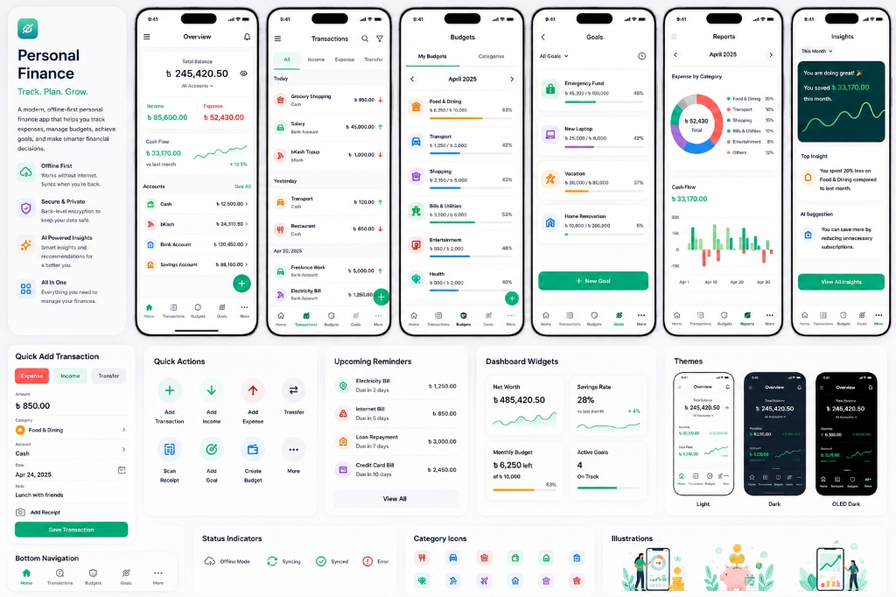
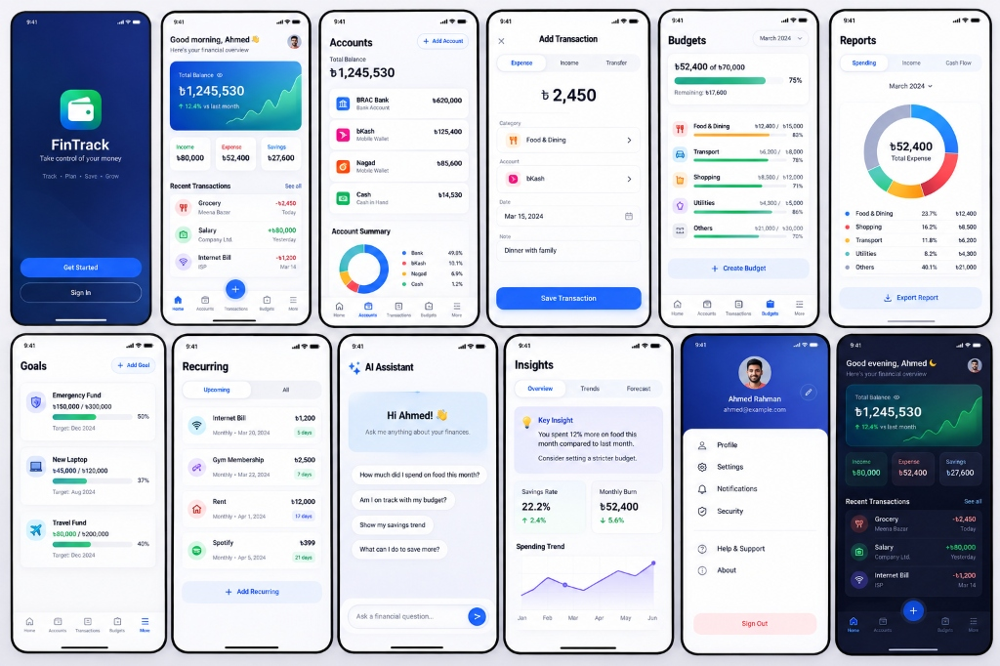
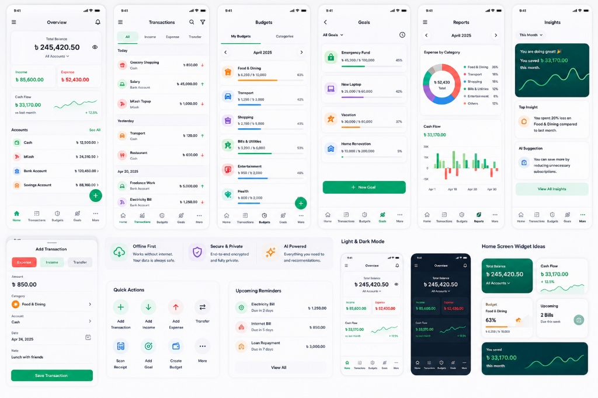

# Personal Finance — UI Design Specification

**Document:** `UI_DESIGN.md`  
**Version:** 1.0  
**Status:** Approved Baseline  
**Last Updated:** 2026-08-12  
**Product:** Personal Finance  
**Platform:** Android-first, iOS-ready  
**Framework:** React Native + Expo + TypeScript  
**Navigation:** Expo Router  
**Primary UX Principle:** Advanced capability with minimal everyday friction  
**Reference Mockups:**

- **High-Fidelity Concept Showcase:** 
- **Layer 1 (Primary Design / Core UI Flows):** 
- **Layer 2 (Secondary Design / Widgets, Quick Actions & Secondary Components):** 

---

# 1. Purpose

This document defines the interface composition and interaction design direction for the Personal Finance application.

It translates:

```text
Project Vision
      ↓
PRD
      ↓
Product Scope
      ↓
Feature Catalog
      ↓
UX Research
      ↓
Information Architecture
      ↓
User Flows
      ↓
UI Design
```

This document defines:

- Screen composition
- Layout hierarchy
- Component placement
- Interaction states
- Form behavior
- Bottom sheets
- Cards
- Lists
- Charts
- Navigation surfaces
- Empty/loading/error states
- Responsive behavior
- Accessibility expectations
- Motion and micro-interactions
- UI rules for AI and financial data

It does not define the final color palette, typography tokens, spacing tokens, or reusable component API in full detail. Those belong in `DESIGN_SYSTEM.md`.

---

# 2. UI Design Goals

The interface should feel:

- Premium
- Calm
- Fast
- Clear
- Trustworthy
- Modern
- Responsive
- Personal
- Efficient

The application should hide complexity rather than display it.

The visual principle is:

> **Simple surface, powerful system underneath.**

---

# 3. Global Composition Principles

## 3.1 One Primary Action

Every major screen should have one dominant action.

Examples:

```text
Home       → Add Transaction
Budget     → Create / Adjust Budget
Goal       → Add Contribution
Lending    → Add Lending
Borrowing  → Add Borrowing
Reports    → Select Report
```

---

## 3.2 Hierarchy Before Decoration

The visual hierarchy should follow:

```text
Primary Value
    ↓
Primary Action
    ↓
Context
    ↓
Details
```

Financial numbers should remain visually dominant where appropriate.

---

## 3.3 Progressive Disclosure

Do not expose every optional field immediately.

Example transaction composer:

```text
Amount
Category
Account
────────────
More Details
```

Expanding `More Details` exposes:

```text
Merchant
Note
Tags
Date
Attachment
Location
Recurring
```

---

# 4. App Shell

The primary mobile shell consists of:

```text
┌──────────────────────────────────────┐
│              Status Bar              │
├──────────────────────────────────────┤
│                                      │
│            Screen Header             │
│                                      │
│            Screen Content             │
│                                      │
│                                      │
├──────────────────────────────────────┤
│ Home | Transactions | + | Analytics | More │
└──────────────────────────────────────┘
```

The bottom navigation should remain visually stable across primary destinations.

The central Add action should visually communicate that it creates something.

---

# 5. Safe Areas

All screens must respect platform safe areas.

The layout must account for:

- Status bar
- Bottom navigation
- Gesture navigation
- Keyboard
- Modal sheets
- Device cutouts

Content should never be hidden underneath system UI.

---

# 6. Home Screen

## Purpose

Answer:

> "How am I doing financially right now?"

## Proposed Hierarchy

```text
Home
│
├── Greeting / Context
│
├── Total Balance
│
├── Monthly Snapshot
│   ├── Income
│   ├── Expense
│   └── Saved
│
├── Primary Add Action
│
├── Budget Snapshot
│
├── Upcoming Items
│
├── Recent Transactions
│
└── Insights
```

The final ordering may change after usability testing.

---

# 7. Home Header

The header should include:

- Greeting or contextual title
- Current date/period context where useful
- Search access
- Optional profile/avatar access

Avoid putting too many controls into the header.

---

# 8. Balance Section

The primary balance should be visually prominent.

Example:

```text
Total Balance

৳ 128,450.00

↑ 8.2% from previous month
```

The comparison must clearly indicate whether the change is:

- Positive
- Negative
- Neutral

The meaning of "positive" should depend on the metric.

---

# 9. Monthly Snapshot

Display a compact summary:

```text
Income          Expense          Saved
৳55,000         ৳31,200         ৳23,800
```

Each metric should support tapping into its deeper analytics where useful.

---

# 10. Quick Action Area

The primary creation action should be highly reachable.

Preferred approach:

```text
[ + Add Transaction ]
```

Tapping opens:

```text
Expense
Income
Transfer
Lend
Borrow
Repayment
```

The primary three actions should receive strongest visual priority.

---

# 11. Budget Snapshot

The home budget section should answer:

> "Am I still on track?"

Example:

```text
Monthly Budget

৳31,200 / ৳40,000

████████░░ 78%

৳8,800 remaining

Projected:
৳38,400
```

Avoid presenting only percentage without absolute values.

---

# 12. Upcoming Section

Display a small number of important upcoming items:

```text
Upcoming

Internet Bill      ৳1,000   Tomorrow
Rahim Repayment    ৳5,000   In 3 days
Salary             ৳50,000  In 6 days
```

Each item should deep-link to its owning entity.

---

# 13. Recent Transactions

Display a compact list.

Example:

```text
Today

Coffee Shop
Food
৳120

Bus
Transport
৳50

Groceries
Food
৳1,450
```

Each row should provide:

- Merchant/title
- Category
- Amount
- Date grouping where relevant
- Direction/type indication

Avoid displaying too many secondary fields.

---

# 14. Home Insights

Insights should appear only when useful.

Possible cards:

```text
Dining spending is 24% higher
than your recent average.

[View Details]
```

The system should avoid filling Home with generic AI-generated text.

---

# 15. Transactions Screen

## Purpose

Provide complete financial history.

## Composition

```text
Header
│
├── Title
├── Search
└── Filter

Summary / Period
│
Transaction List
│
└── Grouped by Date
```

---

# 16. Transaction List

Transactions should generally be grouped by date:

```text
Today

Coffee             -৳120
Bus                 -৳50
Salary           +৳50,000

Yesterday

Groceries         -৳1,450
```

The grouping should remain visually subtle.

---

# 17. Transaction Row

Recommended hierarchy:

```text
[Icon]  Merchant / Title
        Category • Optional note

                         Amount
```

For expenses:

```text
৳1,450
```

For income:

```text
+৳50,000
```

The exact visual treatment belongs to the design system.

---

# 18. Transaction Search

Search should expand without disrupting the transaction context.

Potential interaction:

```text
Tap Search
     ↓
Search Field
     ↓
Results
```

The list should update progressively.

---

# 19. Transaction Filters

Filters should use a bottom sheet.

Suggested layout:

```text
Filters

Date
[ This Month ]

Type
[ All ]

Account
[ All ]

Category
[ All ]

Amount
[ Any ]

Tags
[ Any ]

[ Apply ]
```

The number of active filters should be visible.

---

# 20. Transaction Detail

## Composition

```text
Header
│
├── Back
├── Transaction Type
└── More

Amount

Category
Account
Date
Merchant
Note
Tags
Attachments

Actions
Edit
Duplicate
Delete / Reverse
```

The amount should be the strongest visual element.

---

# 21. Add Transaction Composer

This is one of the most important UI surfaces in the entire application.

## Default Composition

```text
────────────────────────────
Add Expense

৳ 450

Groceries        v
bKash            v

[ Save ]

More Details
────────────────────────────
```

The user should be able to complete a normal transaction without opening additional screens.

---

# 22. Amount Input

The amount field should:

- Receive focus immediately
- Use numeric keyboard
- Support decimal currencies
- Provide clear formatting
- Avoid unnecessary placeholders
- Keep primary action reachable

The amount should visually dominate the composer.

---

# 23. Category Selector

Category selection should:

- Show recent/frequent categories first
- Support search
- Support hierarchical categories
- Allow custom category creation
- Remember selection behavior

A horizontal quick category row may be useful for frequent categories.

---

# 24. Account Selector

The account selector should prioritize:

- Default account
- Recent accounts
- Frequently used accounts

Potential interaction:

```text
bKash ▼
```

Tapping opens a compact selection sheet.

---

# 25. More Details

More details should expand inline or through a secondary sheet.

Fields:

```text
Merchant
Note
Tags
Date & Time
Attachment
Location
Recurring
```

Fields should not become mandatory merely because they exist.

---

# 26. Keyboard Behavior

When the keyboard appears:

- Content should shift appropriately.
- Save action must remain reachable.
- Focus should move predictably.
- The user should not lose entered information.

The amount field should normally open with the numeric keyboard.

---

# 27. Save Feedback

Successful transaction save should provide immediate feedback.

Possible combination:

- Small haptic
- Subtle icon/check animation
- Short visual confirmation
- Updated balance

Avoid long blocking success dialogs.

---

# 28. Unsaved Transaction

If the user dismisses the composer after entering data:

```text
Save draft?
```

or retain a local draft depending on the flow.

The chosen behavior should be consistent across all transaction types.

---

# 29. Quick Transaction UI

Quick transaction cards may appear as:

```text
Favorites

Coffee
৳120

Lunch
৳250

Bus
৳50
```

A tap should open a compact confirmation/edit surface rather than immediately creating a transaction unless the user explicitly enables one-tap mode.

---

# 30. Accounts Screen

## Composition

```text
Accounts

Total Balance

Cash
৳5,000

bKash
৳8,500

Bank
৳95,000

Credit Card
-৳12,000

[ + Add Account ]
```

Accounts should be visually separated by logical grouping where useful.

---

# 31. Account Detail

## Composition

```text
Account Header

Current Balance
৳95,000

Recent Transactions

[ Transfer ]
[ Edit ]

Analytics
```

A credit account should clearly communicate liability semantics.

---

# 32. Budget List

Each budget card should show:

```text
Food

৳7,800 / ৳10,000

████████░░ 78%

৳2,200 remaining

Projected:
৳9,800
```

The card should make risk visible without feeling alarming.

---

# 33. Budget Detail

## Composition

```text
Budget Header

৳7,800 / ৳10,000

Remaining
৳2,200

Utilization
78%

Spending Pace
███████░░░

Forecast
৳9,800

Transactions

[ Edit Budget ]
```

---

# 34. Budget Warning UI

Levels:

## Informational

Subtle status.

## Attention

Visible but not alarming.

## Warning

Higher visual prominence.

## Critical

Strong emphasis with clear action.

The design should use more than color alone.

---

# 35. Goals Screen

Goal cards should emphasize progress:

```text
Laptop

৳62,000
of
৳100,000

62%

৳6,333/month needed

December 2026

██████░░░░
```

---

# 36. Goal Detail

```text
Goal

Laptop

৳62,000 / ৳100,000

62%

Target
December 2026

Required Monthly Saving
৳6,333

Projected Completion
December

Contribution History

[ Add Contribution ]
[ What If? ]
```

---

# 37. Lending Screen

The lending interface should be person-centered.

Example:

```text
Money Lent

Rahim
৳6,000 outstanding
Due in 3 days

Karim
৳2,500 outstanding
Due next week

Nadia
Fully Repaid

[ + Add Lending ]
```

---

# 38. Lending Detail

```text
Rahim

Outstanding
৳6,000

Original
৳10,000

Repaid
৳4,000

Expected Repayment
25 August

Status
Partially Repaid

[ Record Repayment ]
[ Reminder ]
[ Edit ]
```

---

# 39. Borrowing Screen

Use similar structure, but make liability semantics clear.

```text
Money Borrowed

Arif
৳8,000 outstanding
Due in 5 days
```

The UI should never make the user confuse money owed by them with money owed to them.

---

# 40. Repayment Composer

The repayment flow should be compact:

```text
Record Repayment

Outstanding
৳6,000

Repayment Amount
৳ ______

From Account
bKash

[ Record ]
```

After completion:

```text
Remaining
৳4,000
```

---

# 41. Recurring Finance Screen

```text
Recurring

Upcoming

Internet
৳1,000
Tomorrow

Salary
+৳50,000
6 days

Subscriptions

Netflix
৳X/month

Bills

Electricity
৳X
```

Tabs or segmented controls may be evaluated during composition testing.

---

# 42. Reports Screen

Reports should emphasize structured interpretation.

Example:

```text
August Summary

Income      ৳55,000
Expense     ৳31,200
Saved       ৳23,800

Top Categories

Food        ৳8,450
Transport   ৳5,200
Bills       ৳4,100
```

Charts should support the summary rather than replace it.

---

# 43. Analytics Overview

Suggested composition:

```text
Analytics

Period Selector

Financial Summary

Income
Expense
Savings

Key Trends

[ Chart ]

Top Categories

Insights

Forecast
```

---

# 44. Spending Analytics

The screen should answer:

> "Where is my money going?"

Possible composition:

```text
Spending

Total
৳31,200

Category Distribution
[ Chart ]

Top Categories

Food         ৳8,450
Transport    ৳5,200
Bills        ৳4,100

Trend
[ Chart ]

[ View Transactions ]
```

---

# 45. Cash-Flow Analytics

```text
Cash Flow

Income
৳55,000

Expense
৳31,200

Net
৳23,800

[ Trend Chart ]

Projected End of Month
৳X
```

Actual and projected values must be visually distinct.

---

# 46. Forecast UI

Forecast screens should contain:

```text
Forecast

Projected Expense
৳32,500

Current
৳21,700

Expected Remaining
৳10,800

Based on:
6 months of history

[ View Method ]
```

Avoid presenting a prediction without context.

---

# 47. Financial Health UI

```text
Financial Health

84 / 100

Good

Savings        Strong
Budget         Good
Cash Flow      Strong
Debt           Attention
Goals          Good

What is affecting your score?

[ View Details ]
```

The score must remain explainable.

---

# 48. What-If Simulator

Recommended layout:

```text
What If?

Monthly Saving
৳5,000
[-]      [+]

Goal Completion
December 2026

Scenario Completion
October 2026

Impact
+৳10,000 saved by target date
```

Use sliders only when they actually improve interaction.

For precise financial values, direct numeric entry should remain available.

---

# 49. AI Insight Card

An AI insight should be compact by default.

```text
Insight

Dining spending is 31% higher
than your recent average.

Why?
Restaurant spending increased
by ৳2,400.

[ View Details ]
```

Do not display large AI narratives on the dashboard.

---

# 50. AI Insight Detail

```text
Insight

Dining spending increased 31%.

Supporting data
• Current: ৳8,450
• 3-month average: ৳6,450
• Difference: +৳2,000

Why this matters
You are approaching your food budget.

Suggested action
Reduce dining spending this week.

[ View Transactions ]
```

The calculation source should be visible where useful.

---

# 51. AI Recommendation UI

Recommendations should include:

```text
Recommendation

Reduce restaurant spending by about
৳1,500 this month.

Potential impact
Budget remains on track.

[ View Budget ]
```

Recommendations should not appear as commands.

---

# 52. AI Assistant Screen

## Composition

```text
AI Assistant

Ask about your finances...

----------------------------

Suggested Questions

How much did I spend this month?
Why did expenses increase?
How much do people owe me?

----------------------------

Conversation
```

The input should be reachable and easy to use.

---

# 53. AI Answer

Answers should prioritize the direct answer first.

Example:

```text
You spent ৳31,200 this month.

That's 8% lower than last month.

Main increase:
Transport +৳1,200
```

A user should not have to read a paragraph to find a number.

---

# 54. Voice Input UI

Voice recording should provide clear state:

```text
Listening...

"আজকে ৪৫০ টাকা বাজার করেছি"
```

Then:

```text
I found:

Expense
৳450
Groceries
Today

[ Edit ]
[ Save ]
```

Never commit uncertain extraction without appropriate confirmation.

---

# 55. Receipt UI

After receipt processing:

```text
Receipt

Merchant
ABC Super Shop

Total
৳1,450

Date
12 Aug

Category
Groceries

Items
...

[ Review ]
[ Save ]
```

Low-confidence fields should be visibly marked.

---

# 56. Search Screen

```text
Search

[ Search transactions, accounts, people... ]

Recent Searches

Results
```

Search results may be grouped:

```text
Transactions
Accounts
Goals
People
```

---

# 57. Global Filter Sheet

The filter sheet should use grouped sections:

```text
Filter

Date
[ This Month ]

Type
[ All ]

Account
[ All ]

Category
[ All ]

Amount
[ Any ]

Tags
[ Any ]

Reset     Apply
```

---

# 58. Empty State Pattern

Every empty state should contain:

```text
Illustration / Icon

Title

Short explanation

Primary action
```

Avoid empty screens containing only:

> No data.

---

# 59. Loading State Pattern

Use content-aware skeletons when content structure is known.

Example:

```text
[████████████]
[██████]

[██████████]
[████████]
```

For immediate transaction saves, prefer optimistic/local feedback rather than a long loading state.

---

# 60. Error State Pattern

Error screens should include:

```text
What happened
Why it matters
What the user can do
```

Example:

```text
Couldn't load your analytics.

Your transaction data is safe.

[Retry]
```

---

# 61. Offline State

A lightweight offline indicator may appear in:

- Header
- Settings
- Sync status

Avoid showing a persistent intrusive banner across every screen.

Example:

```text
Offline
Changes are saved locally.
```

---

# 62. Sync Status UI

Possible states:

```text
✓ Synced
↻ Syncing
• Changes pending
! Sync issue
```

The user can open a detailed sync screen when needed.

---

# 63. Notification Detail

Notifications should not duplicate the entire feature UI.

Example:

```text
Budget Warning

You've used 82% of your food budget.

[ View Budget ]
```

The action should deep-link to the source.

---

# 64. Permission Prompt UX

Permission requests should occur at the moment of need.

Example:

```text
Scan Receipt

Camera access lets you capture receipts
and automatically extract transaction details.

[ Continue ]
```

Then trigger the operating system permission request.

---

# 65. Destructive Confirmation UI

For permanent destructive actions:

```text
Delete All Financial Data?

This permanently removes your local
financial records.

We recommend exporting a backup first.

[ Export Backup ]
[ Cancel ]
[ Delete ]
```

The destructive action should never be visually ambiguous.

---

# 66. Form Composition Rules

Forms should:

- Group related inputs
- Put required fields first
- Use inline validation
- Use contextual defaults
- Avoid unnecessary separators
- Keep primary action visible
- Preserve entered values

---

# 67. Button Hierarchy

The interface should generally use:

```text
Primary
Secondary
Tertiary
Destructive
```

There should rarely be multiple competing primary buttons on one screen.

---

# 68. Cards

Cards should only be used when they provide clear grouping.

Avoid carding every line item.

Good:

- Budget summary
- Goal progress
- Important insight

Bad:

- Every label
- Every transaction row
- Every simple setting

---

# 69. Bottom Sheets

Bottom sheets are appropriate for:

- Quick actions
- Account selection
- Category selection
- Filters
- Short forms
- Contextual actions

They are not ideal for long multi-step workflows.

---

# 70. Full-Screen Forms

Use full-screen forms when:

- Many fields exist
- The task requires explanation
- Multiple sections are needed
- The user needs to review a complex object

Examples:

- Advanced recurring rule
- Complex account configuration
- Data import mapping

---

# 71. List Design

Lists should optimize scanning.

Recommended hierarchy:

```text
Title
Supporting context
Amount / Status
```

Avoid long metadata strings.

Use secondary detail only where it helps decisions.

---

# 72. Status Representation

Status should be represented using a combination of:

- Text
- Icon
- Position
- Color

Never rely only on color.

Example:

```text
Overdue ⚠
Partially Repaid
Fully Repaid ✓
```

---

# 73. Date Formatting

Use human-friendly dates in normal UI:

```text
Today
Yesterday
Tomorrow
In 3 days
25 Aug
```

Use exact dates where precision matters.

---

# 74. Amount Formatting

Financial values should have:

- Consistent decimal rules
- Currency context
- Clear positive/negative treatment
- Proper grouping for large numbers

Avoid excessive decimals unless the currency requires them.

---

# 75. Responsive Layout

The mobile UI should adapt to:

- Small Android phones
- Large Android phones
- Different aspect ratios
- Dynamic font sizes
- Keyboard appearance
- Landscape where supported

The design must not depend on one device width.

---

# 76. Tablet / Larger Screen Readiness

Although Android phones are the primary target, layouts should avoid assumptions that make larger screens unusable.

Future layouts may use:

```text
Master
│
└── Detail
```

where appropriate.

Do not build a separate tablet architecture prematurely.

---

# 77. Accessibility

Every screen must consider:

- Screen-reader labels
- Focus order
- Touch target size
- Dynamic text
- Color contrast
- Reduced motion
- Accessible chart alternatives
- Semantic roles

---

# 78. Motion

Animation should communicate state.

Appropriate:

- Bottom-sheet transitions
- Transaction saved
- Progress updates
- Goal completion
- Filter application
- Chart transitions

Avoid long or repetitive animations.

---

# 79. Haptics

Use sparingly for:

- Save success
- Selection
- Important completion
- Major milestone

Haptic feedback must never be the only confirmation.

---

# 80. UI State Matrix

Every important screen should support:

```text
Default
Loading
Empty
Error
Success
Offline
Refreshing
Disabled
Partially Available
```

AI-enabled screens may additionally require:

```text
AI Processing
AI Unavailable
AI Result
AI Result Needs Review
```

---

# 81. Data Integrity in UI

The UI should never display stale derived financial values after a successful mutation.

Examples:

After adding an expense:

- Account balance updates.
- Budget updates.
- Dashboard updates.
- Relevant analytics refresh.
- Goal-related data updates where applicable.

Local-first architecture should make the user see the local result immediately.

---

# 82. Optimistic UI

Optimistic updates are acceptable when:

- The operation is locally durable.
- Failure can be reconciled.
- The visual state can be safely reverted.

For example, local transaction creation may immediately update the interface.

---

# 83. AI Data Presentation

Where an AI statement relies on financial metrics, provide access to supporting information.

Example:

```text
AI Insight
↓
Why?
↓
Supporting Metrics
↓
Source Transactions
```

This improves trust.

---

# 84. AI vs Actual Data

Use clear distinction:

```text
Actual
৳31,200

Forecast
৳32,500

AI Insight
"You're likely to exceed the budget."
```

These are three different information types and should not visually imply equal certainty.

---

# 85. UI Anti-Patterns

Avoid:

- Excessive cards
- Long transaction forms
- Too many badges
- Too many accent colors
- Huge dashboards
- AI text walls
- Persistent banners
- Hidden critical actions
- Tiny touch targets
- Requiring horizontal scrolling for essential information
- Full-screen modal chains
- Unnecessary confirmation dialogs

---

# 86. Screen Composition Testing

Before implementation is considered final, candidate designs should be compared for:

- Task speed
- Visual clarity
- Scanability
- Thumb reach
- Error rate
- Discoverability
- Perceived effort
- Emotional response

The fastest design should not automatically win if it significantly decreases accuracy or discoverability.

---

# 87. Primary Screens to Prototype First

The first high-fidelity UI prototypes should be:

1. Home
2. Add Expense Composer
3. Transactions
4. Transaction Detail
5. Accounts
6. Budget Detail
7. Goal Detail
8. Lending Detail
9. Analytics Overview
10. AI Insight Detail

These screens represent the highest-value UX foundation.

---

# 88. UI Acceptance Criteria

The UI is considered ready for implementation when:

- Navigation structure is fixed.
- Major screen hierarchy is approved.
- Primary actions are clear.
- High-frequency workflows are low-friction.
- Empty/loading/error states are specified.
- Offline states are considered.
- Accessibility requirements are defined.
- AI states are defined.
- Destructive states are defined.
- Responsive behavior is understood.
- Reusable patterns are identified.

---

# 89. Relationship With Other UX Documents

The UX documentation now follows:

```text
UX_RESEARCH.md
       ↓
INFORMATION_ARCHITECTURE.md
       ↓
USER_FLOWS.md
       ↓
UI_DESIGN.md
       ↓
DESIGN_SYSTEM.md
```

This document defines **how screens should be composed**.

The next document, `DESIGN_SYSTEM.md`, should define the reusable visual language:

- Color tokens
- Typography
- Spacing
- Radius
- Elevation
- Icons
- Buttons
- Inputs
- Sheets
- Cards
- Lists
- Charts
- Status styles
- Motion
- Accessibility tokens

The design system should make the UI consistent without making every screen visually identical.

---

# 90. Final UI Principle

The application should feel:

> **Effortless for the first five seconds, powerful after five minutes, and trustworthy after months of use.**

Every future screen should preserve this principle.
